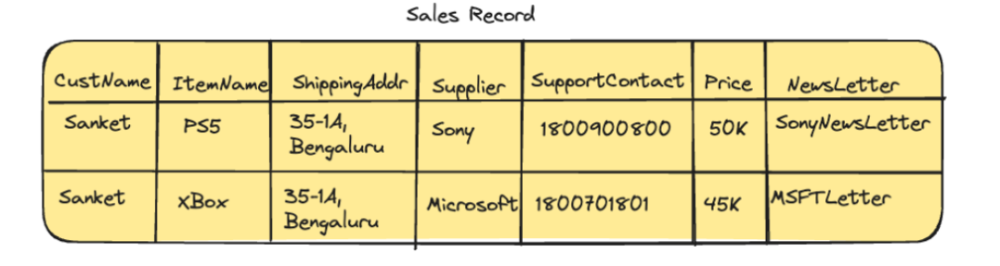
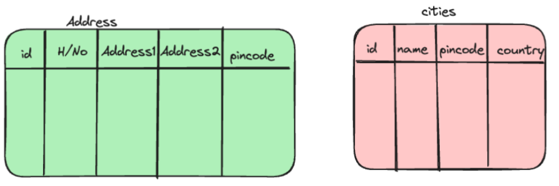

### Noramlization

# Normalization is a technique that helps to reduce the redundant data from the database.

# that helps to design a database which is most efficient and least redundant data storage

### 1NF - First normal Form

## Every Attribute must be have the atomic values (non seperatable)

# as in the sales table the shipping address can be devided into the multiple columns.

# like

# and from the shipping address the pincode and the cities can be seperated. can be writter in the another table to identify the city using the pincode.

🎯 What Happens When You Follow 1NF:

✅ Better Data Integrity – Each data point is stored clearly and accurately.

✅ Easier to Query – No need to parse or split values in SQL.

✅ Simpler Updates – Changes affect only the right row/column, not a comma-separated list.

✅ Prevents Redundancy and Anomalies – No risk of inconsistent data in compound fields.

✅ Prepares database for 3NF

### 2NF - Second Normal Form

## Rules

## 1) The database should be already 1NF Implimented

## 2) All the attributes(tables) should depenend on the key identifire

# Like the address table were seperated from the salse table we can keep the address Id at the address in the sales table. so that changing in the one fied of one entity should not affect the whole table.

# means we seperate the data from the table that can be identified uniquly. like in the sales table the item name and the price can be uniqly or seperatly indentified. and then we can keep the seperated items table key or id in the sales table and if wants to change the items price then the whole sales table will also not get affected (will not take much time). and the sale talbe need not to touch anyway.

🧱 2NF – Second Normal Form
✅ Rules to Follow 2NF:

The table must already be in 1NF.

All non-key attributes must be dependent on the entire primary key (not just part of it).

⚠️ What Does That Mean?

It mostly applies when the primary key is composite (i.e., made up of more than one column).

🔍 Problem in 1NF:

StudentID CourseID StudentName CourseName
101 C001 Alice Math
101 C002 Alice Science

Primary Key: (StudentID, CourseID)

✅ Already in 1NF (no multi-valued columns)

❌ But: StudentName depends only on StudentID, and CourseName depends only on CourseID, not on the full key.

✅ After Applying 2NF:
Split into two tables to remove partial dependency:

Table 1: StudentCourse

StudentID CourseID
101 C001
101 C002
Table 2: Students

StudentID StudentName
101 Alice
Table 3: Courses

CourseID

Science
🎯 Benefits of 2NF:
✅ Eliminates partial dependencies

✅ Reduces data redundancy

✅ Improves data consistency

✅ Prepares database for 3NF

### Third Normal Form

- Database should be 2NF Implemented
- database should not have any transitive dependency (all fields can be determinded/identified by the key/id of table not other column)

🔍 Example (in 2NF but not 3NF):

EmployeeID Name DepartmentID DepartmentName
101 Alice D01 HR
102 Bob D02 IT
Primary Key: EmployeeID

❌ DepartmentName is dependent on DepartmentID, which is not a key in this table
This is a transitive dependency.

✅ After Applying 3NF:
Table 1: Employees

EmployeeID Name DepartmentID
101 Alice D01
102 Bob D02
Table 2: Departments

DepartmentID DepartmentName
D01 HR
D02 IT
Now:

Every field in the Employees table is directly dependent on EmployeeID

No transitive dependencies 🎉

🎯 Benefits of 3NF:
✅ Removes unnecessary indirect relationships

✅ Reduces redundancy even more

✅ Improves data accuracy

✅ Makes updates easier and safer

### If any update or delete operation will cause very heavy query then we must normalize the database.

